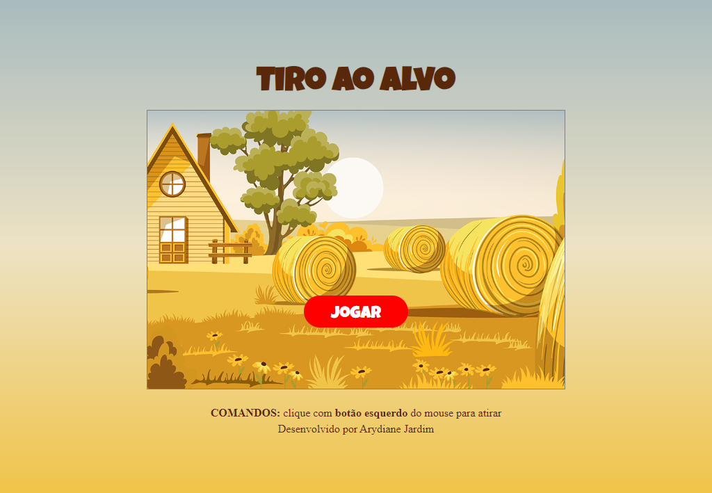
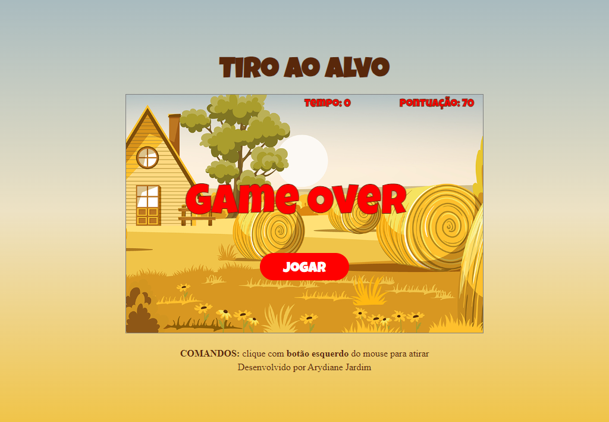

# Jogo Tiro ao Alvo
No <b>Jogo de Tiro ao Alvo</b>, você se tornará um excelente atirador com um único objetivo: acertar os alvos que surgem de forma aleatória na tela. 
Sua missão é se superar a cada momento, mirando com precisão e agilidade para atingir o maior número possível de alvos no período de 30 segundos.

Pegue seu mouse e prepare-se para a ação! Ao <b>clicar com o botão esquerdo</b>, você disparará sua arma virtual e tentará acertar os alvos em movimento. 
Cada vez que sua mira for certeira, você ganhará 10 pontos, aumentando sua pontuação total.
Se desafie, aperfeiçoe suas habilidades de mira e reflexos, e veja até onde consegue chegar na busca pela pontuação máxima. 
   
## 💻 Layout   

  
  

## 🔧 Tecnologias
As tecnologias usadas foram:
- HTML
- Canvas API
- CSS
- JavaScript

## 🛠️ Como Executar o Projeto

Para jogar, basta [clicar aqui](https://jogo-tiro-ao-alvo.vercel.app/) e desfrutar da experiência!
Divirta-se!

Créditos da imagem de fundo: <a href="https://br.freepik.com/vetores-gratis/peisage-de-um-campo-com-palheiros_10117293.htm">Imagem de frimufilms</a> no Freepik
